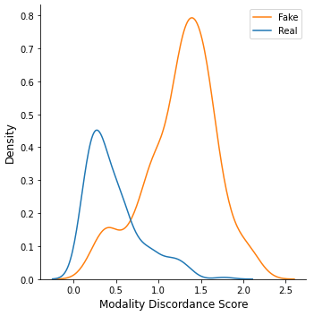
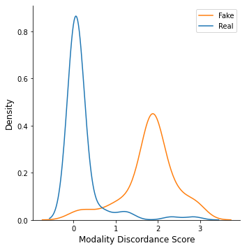

# Leveraging Inter-modality Discordance for Multimodal Fake News Detection

This is the source code for the paper "Leveraging Inter-modality Discordance for Multimodal Fake News Detection"
## Getting started

## Setup

1. Clone this repository:
   ```$ git clone https://github.com/mudit-dhawan/FND.git && cd FND ```

2. Create a conda environment with all packages:
   ```$ conda create -n new environment --file requirements.txt ```

3. Download the dataset from the drive link and store it under the  ```./dataset/``` folder. create a sub-directory for each type of dataset.
   1. raw-politifact
   2. clean-gossipcop
   3. raw-gossipcop


## Reproduce Results
The scripts to reproduce our evaluation can be found in the ```./code/src/``` directory.

*Uncomment the ```DATA_PATH``` and ```IMAGE_ROOT_DIR``` variable according to the dataset being used for evaluation.*

```$ python ./code/src/main.py ```


## Case Studies (RQ-2)

We provide some jupyter notebooks to demostrate our RQ2 and the analysis of clean and raw versions of FakeNewsNet Dataset.

- ```case_study_kde_plots.ipynb``` : Shows the efficacy of the Inter-modality Discordance score introduced in our research. 
- ```clean_raw_compare.ipynb``` : Comparison of the raw and clean versions of the FakeNewsNet Repository. 

 


## Citation
